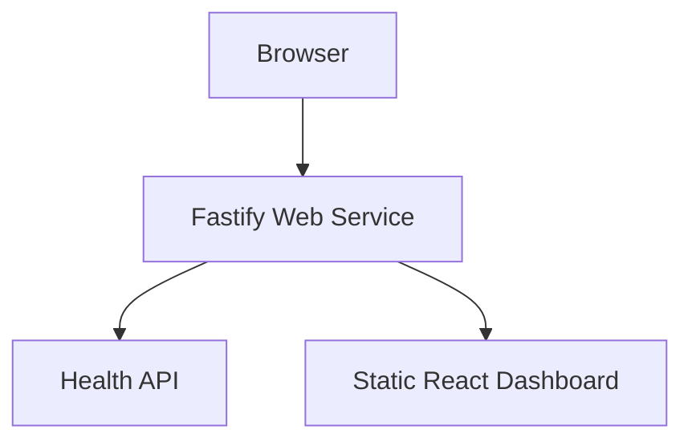
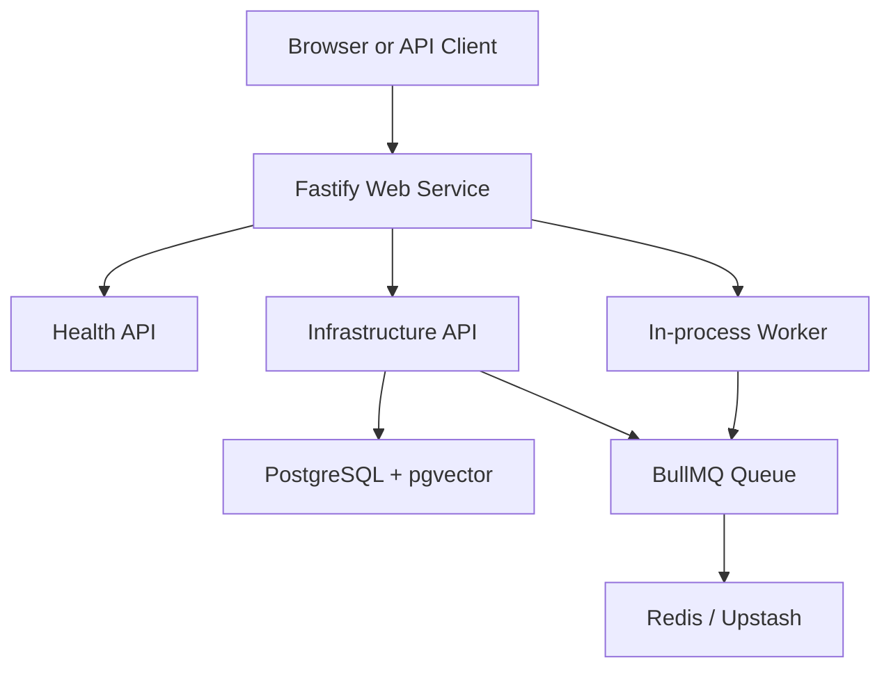
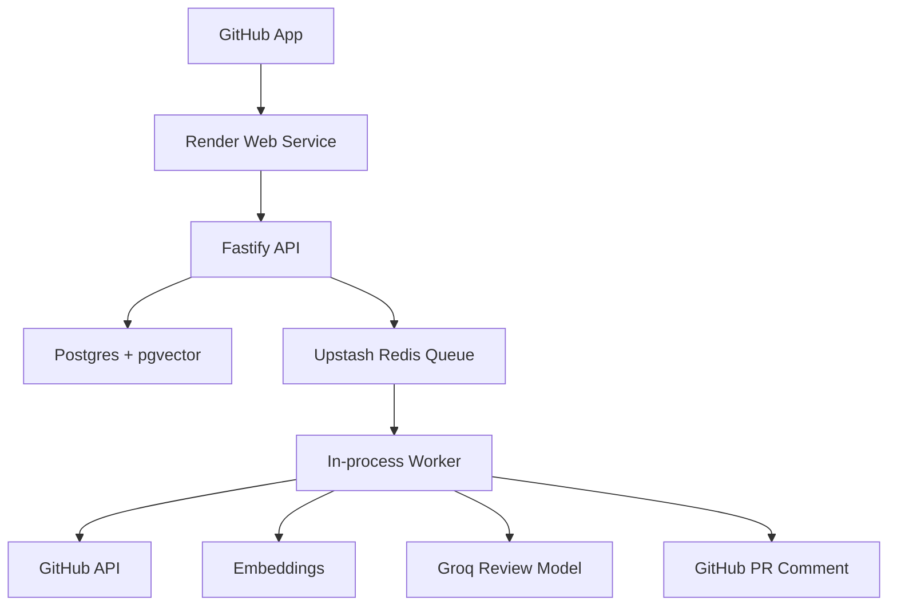

# PatchWise Architecture

PatchWise is intentionally light for the MVP. It uses one web service, one database, and one external queue.

## Stage 1 Architecture



## Stage 2 Architecture



## Target MVP Architecture



## Responsibilities

### Fastify API

- receives GitHub webhooks
- verifies signatures
- creates background jobs
- serves dashboard APIs
- serves the built React dashboard
- reports database and queue health

### Worker

- indexes repositories
- reviews pull requests
- updates repository vectors after merge
- processes BullMQ jobs inside the same Render web service for the MVP

### PostgreSQL + pgvector

- stores installations
- stores repositories
- stores review history
- stores code chunks and embeddings
- uses `vector(384)` for the first lightweight embedding path

### Upstash Redis

- stores lightweight background jobs
- prevents webhook requests from doing slow work
- can be configured with either `REDIS_URL` or split Upstash host/port/password variables

### Groq

- generates the pull request review summary

## Render Deployment Shape

```text
Render Web Service
  npm install
  npm run build
  npm start

External services
  PostgreSQL with pgvector
  Upstash Redis
  Groq API
```
